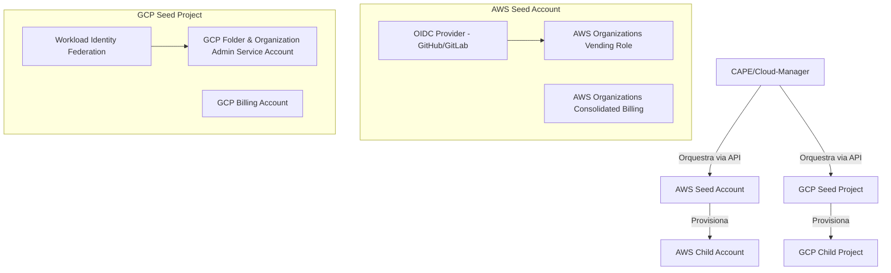

# ADR-013: Arquitetura de Contas Semente (Seed Accounts) e Estratégia de Recuperação de Desastres (DR)

- **Status:** Proposto
- **Data:** 2026-07-29
- **Pilar CloudOps:** Governança, Resiliência e Continuidade de Negócio
- **Relacionado a:** ADR-003, ADR-005, ADR-006

## Contexto e Problema
O funcionamento do `cloud-manager` (CAPE) baseia-se na existência de exatamente **uma Conta Semente (Seed/Base Account)** por provedor de nuvem (AWS, GCP, Azure). Essas contas sementes são os pontos de ancoragem da segurança, governança e faturamento da plataforma. Nelas são configurados:
1. **Federação de Identidades via OIDC:** Para permitir que pipelines CI/CD implantem recursos nas contas filhas sem o uso de chaves estáticas.
2. **Configuração de Billing (Faturamento):** Mecanismos corporativos de faturamento compartilhado herdados por todas as contas filhas.
3. **API Vending Machine / Permissões Programáticas:** Credenciais e roles IAM com privilégios de criação de contas organizacionais ou projetos.

Caso uma dessas contas base falhe ou sofra exclusão acidental, o pipeline de provisionamento de novas contas é interrompido. Portanto, precisamos detalhar a arquitetura das contas semente, o processo de gerenciamento de pools/booking, e estabelecer um plano robusto de **Recuperação de Desastres (Disaster Recovery)** com um checklist simulável.

---

## Estrutura da Arquitetura das Contas Semente
Toda conta semente deve seguir a estrutura descrita no diagrama abaixo:

---

## 1. Fluxo de Criação de Novas Contas e Pool de Contas (Account Pool)
Para contornar a lentidão inerente na criação física de contas cloud nos provedores (que pode levar de 5 a 15 minutos), a plataforma implementa o padrão **Account Pool**:
1. **Pré-provisionamento:** A conta semente cria previamente um pool de contas vazias e as mantém em estado `READY_TO_BOOK`.
2. **Ciclo de Vida do Pool:** Um job recorrente mantém a quantidade mínima configurada no pool (ex: 3 contas por provedor).
3. **Consumo Instantâneo:** Quando um usuário solicita uma conta, a plataforma realiza o *booking* imediato de uma conta do pool.

---

## 2. Processo de Booking (Reserva de Contas)
O processo de booking garante que não haja concorrência ou dupla alocação de contas:
1. **Requisição de Onboarding:** Um payload de criação chega ao CAPE.
2. **Reserva Exclusiva (Booking):**
   - Transação atômica do banco de dados busca uma conta com estado `READY_TO_BOOK` filtrada pelo provedor desejado.
   - Aplica um *pessimistic/optimistic lock* para atualizar o estado para `BOOKED`, vinculando o ID do novo dono e do Centro de Custo.
3. **Ajuste de Metadados:** A conta semente sincroniza o novo nome amigável e as permissões de acesso finais.
4. **Reposição do Pool:** O pool manager é notificado para disparar o pré-provisionamento assíncrono de uma nova conta semente-filha em background.

---

## 3. Plano de Recuperação de Desastres (DR) e Checklist de Nova Conta Base
Em caso de catástrofe total (perda da conta base/semente), o seguinte checklist passo a passo deve ser simulado e executado pelo time de CloudOps para restaurar a integridade da plataforma:

### Checklist de Recuperação / Nova Conta Base

#### [ ] Passo 1: Provisionamento Físico da Conta Root
- [ ] Criar a nova conta (AWS Account) ou Projeto (GCP Project) que servirá de semente.
- [ ] Vincular o faturamento master corporativo à nova conta base.

#### [ ] Passo 2: Federação de Identidade (OIDC / Workload Identity Federation)
- [ ] **AWS:** Criar o provedor de identidade IAM OIDC vinculando os endereços do GitHub Actions (`https://token.actions.githubusercontent.com`) ou GitLab.
- [ ] **GCP:** Criar o Workload Identity Pool e o OIDC Provider correspondente.

#### [ ] Passo 3: Criação de Roles de Orquestração (Vending Role)
- [ ] Criar a role/service-account programática do CAPE com políticas para:
  - `organizations:CreateAccount` (AWS)
  - `resourcemanager.projects.create` (GCP)
- [ ] Associar a permissão de assunção de role pelo provedor OIDC criado no Passo 2.

#### [ ] Passo 4: Atualização das Configurações no CAPE
- [ ] Atualizar os segredos e chaves no banco de dados e arquivos de ambiente do `cloud-manager` (`.env` ou Secrets Manager).
- [ ] Reiniciar a plataforma e testar o provisionamento de uma nova conta de testes a partir da nova base.

---

## 4. Plano de Testes BDD (Cucumber) de Disaster Recovery
Para garantir a resiliência e automatizar a verificação do comportamento da plataforma frente à indisponibilidade de uma Conta Semente, implementamos testes de aceitação automatizados (BDD/Cucumber). Os cenários cobrem:

1. **Simulação de Desastre (Seed Inacessível/Ausente):**
   - **Gatilho:** Remoção/Indisponibilidade da configuração da Conta Base no banco de dados do CAPE.
   - **Comportamento Esperado:** Solicitações de criação de novas contas para o respectivo provedor falham graciosamente, transicionando para o estado `FAILED` e registrando o erro explícito de ausência de conta semente.

2. **Simulação de Recuperação (Reestabelecimento da Seed):**
   - **Gatilho:** Cadastro de uma nova Conta Base válida correspondente ao provedor.
   - **Comportamento Esperado:** Novas solicitações de criação e vinculação de faturamento voltam a funcionar, transicionando com sucesso para o estado `ACTIVE` e vinculando-se à nova conta restaurada.

Os cenários de teste são validados via o arquivo [disaster_recovery.feature](file:///Users/govinda/projetos/cloud-manager/src/test/resources/features/disaster_recovery.feature) e executados na pipeline de CI/CD.

---

## Consequências
- **Positivas:**
  - Clareza absoluta sobre o papel vital das Contas Semente e a dependência direta da federação OIDC e Billing corporativo.
  - Mitigação de riscos de indisponibilidade severa através de um playbook detalhado de Disaster Recovery.
- **Negativas/Riscos:**
  - A perda física de uma conta semente requer intervenção manual do time de CloudOps nos consoles de nuvem para restabelecer os vínculos de OIDC e Billing master.
