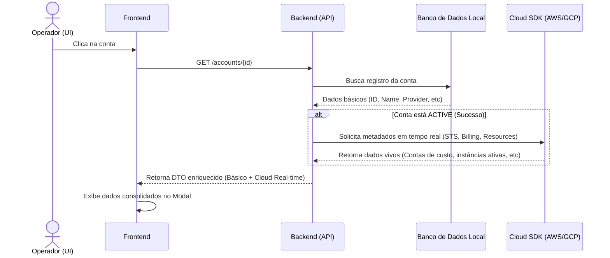

# ADR 014: Visualização de Detalhes da Conta Cloud no Frontend (Enriquecimento em Tempo de Execução)

**Status:** PROPOSTO  
**Data:** 2026-07-29  
**Autor:** Antigravity  

---

## Contexto
O gerenciador de nuvem (Cloud Manager) armazena em seu banco de dados local apenas metadados essenciais de cada conta (ID, nome, e-mail do dono, provedor, centro de custo e estado do provisionamento). 

Salvar todas as informações dinâmicas de nuvem (como custos diários, quantidade de recursos ativos, cotas e status de segurança) diretamente no banco de dados local introduziria complexidade desnecessária de sincronização, risco de obsolescência de dados e inchaço da base de dados.

Contudo, ao inspecionar uma conta através da interface gráfica, o operador precisa de informações detalhadas e em tempo real para tomar decisões ou diagnosticar falhas de provisionamento.

---

## Decisão
Adotaremos uma abordagem de **Enriquecimento Dinâmico em Tempo de Execução** (Runtime Enrichment) acoplada ao padrão de **Máquina Burra (Stateless UI)**. 

Ao chamar o endpoint `GET /accounts/{id}`:
1. O backend recupera a conta do banco de dados local.
2. Se a conta estiver no estado `ACTIVE` ou similar, o backend realiza chamadas em paralelo (assíncronas) via SDK do provedor de nuvem (AWS ou GCP) para coletar dados em tempo real.
3. Consolida essas informações em uma resposta estendida (DTO enriquecida) sem salvar esses dados dinâmicos no banco de dados local.
4. O frontend consome esse JSON enriquecido e o apresenta no modal de detalhes.

---

## Análise de Dados e Fontes

### 1. Dados Nativos (Armazenados no Banco Local)
Esses dados vêm diretamente da tabela `accounts` e servem como chave de busca:
* `id`: Identificador interno.
* `name`: Nome identificador do projeto/ambiente.
* `email`: Contato do administrador responsável.
* `provider`: `AWS` ou `GCP`.
* `state`: Estado do ciclo de vida local.
* `costCenter`: Centro de custo associado.
* `errorMessage`: Log de falha persistido se o estado for `FAILED`.
* `createdAt` e `updatedAt`: Carimbos de auditoria local.

### 2. Dados Enriquecidos em Tempo de Execução (via APIs de Nuvem)

#### Para Provedor AWS:
* **Account ID e Identidade:** Consulta ao AWS STS (`sts:GetCallerIdentity`) para retornar o ID da conta AWS real e a Role/IAM Session utilizada.
* **Associação de Billing:** Consulta ao AWS Organizations / Billing API para extrair o status do vínculo com a Conta Master/Semente.
* **Métricas de Recursos Ativos (Smoke Check):**
  * Contagem de instâncias EC2 ativas (via EC2 client).
  * Quantidade de buckets S3 associados (via S3 client).
* **Consumo Financeiro em Tempo Real (FinOps):** Integração rápida com o AWS Cost Explorer (chamada leve de API para obter o gasto acumulado no mês corrente - *Month-to-Date*).
* **Quotas e Limites:** Verificação de quotas críticas (ex: vCPUs rodando na região ativa) via AWS Service Quotas.

#### Para Provedor GCP:
* **Project Metadata:** Consulta ao GCP Resource Manager para obter o `Project Number` numérico real e o ciclo de vida do projeto no GCP.
* **Status da Conta de Faturamento (Billing):** Consulta à API de Cloud Billing para verificar se o projeto está devidamente vinculado e ativo na Billing Account corporativa.
* **APIs Habilitadas:** Validação de APIs críticas de infraestrutura (Compute Engine, IAM, Cloud Storage) para assegurar que a baseline foi aplicada com sucesso.
* **Métricas de Recursos Ativos:**
  * Quantidade de instâncias de VM ativas.
  * Presença de buckets no Cloud Storage.
* **Consumo Financeiro (FinOps):** Custo acumulado do projeto no mês corrente obtido de forma dinâmica via Billing API.

---

## Diagrama do Fluxo de Informação

---

## Consequências

### Positivas
* **Dados Vivos e Confiáveis:** O operador visualiza custos e recursos exatamente como estão na nuvem no momento da consulta.
* **Banco de Dados Enxuto:** Evita tabelas gigantescas ou desatualizadas com dados históricos ou temporários de nuvem.
* **Simplificação do Fluxo:** O controle de estado de auditoria é delegado para quem é dono dele (a própria cloud).

### Negativas / Riscos
* **Latência Acrescida:** A requisição HTTP `GET /accounts/{id}` demorará mais devido às chamadas de rede externas da AWS/GCP (deve ser mitigada com timeouts agressivos de 2s e fallback amigável caso a API de nuvem falhe).
* **Consumo de Quota de API (Rate Limits):** Consultas repetidas de operadores podem gastar quotas de API de leitura da AWS/GCP (mitigado ao cachear o resultado em memória no backend por um período muito curto, ex: 1 a 2 minutos).
